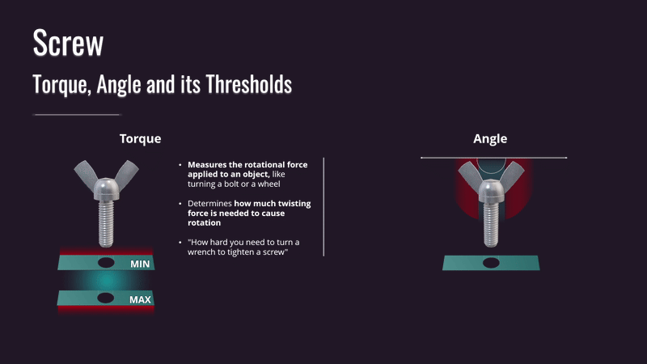
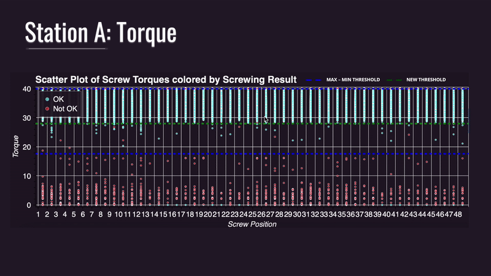

# Volta: Reducing Errors in Automotive Assembly Lines with Applied Machine Learning

## Context

**Volta** is a real-world project based on automotive manufacturing data. It focuses on optimizing robotic operations in two key industrial stations of a battery assembly line:

* **Station A (ST120)**: Battery module placement and screwing
* **Station B (ST160)**: Insertion of electrical connectors between modules

Errors in early stages (positioning, torque, angle) directly impact later operations, leading to production failures (NOKs), rework, and throughput loss. Volta uses end-to-end analytics, interpretable machine learning, and time series modeling to detect causes and propose process improvements.

---

## Process Flow

Every battery unit passes through:

* **Placement (Station A)**: Robotic alignment of modules with precision in position and pressure
* **Screwing (Station A)**: Controlled fastening of 45 screws using torque and angle parameters
* **Connector Insertion (Station B)**: Placement of electrical connectors between 12 modules

Operational specifics:

* **2 robotic arms per line** (Robot 10 & Robot 20)
* **3 production lines in parallel**, same configuration
* Output from Station A is routed directly to Station B in continuous flow

---

## Data Preparation & Engineering

* Cleaned and standardized over 1,200 raw process variables
* Extracted and synced timestamps, calculated durations with ms precision
* Mapped screw IDs to modules, robots, batteries
* Engineered custom tolerances (UT/LT) based on statistical profiles of OK parts

> Final output: 3 curated datasets (cleaned, denoised, and ML-ready)

---

## Root Cause & Statistical Analysis

* Module-level failure heatmaps (NOK by screw position)
* Time-segmented EDA to detect patterns in specific shifts or robots
* Analyzed X/Y placement errors and their effect on connector fit
* Robot-level performance comparison (R10 vs R20)

> Connector-level analysis identified strong propagation of errors from Station A

---

## Time Series Forecasting with ETS

To understand production flow dynamics and preempt anomalies, we implemented Exponential Smoothing (ETS) models:

* Modeled screw durations and torque/angle patterns over time
* Detected early indicators of drift or tool wear
* Combined ETS outputs with NOK spikes to anticipate failures before they cascade

This approach allowed us to introduce a temporal layer into the diagnosis, improving both explainability and prevention.

---

## ML Modeling & Interpretability

Using **XGBoost** and **SHAP**, we:

* Predicted NOK events from process variables in Station A
* Ranked most influential features (misalignment, torque ratio, robot ID)
* Simulated changes in tolerance boundaries and robot configurations

> SHAP clearly highlighted compound effects (angle AND torque deviation required to trigger NOKs)

---

## Results & Business Impact

* Reduced connector NOK rate in Station B by simulating tolerance adjustments upstream in Station A
* Identified high-risk robot-screw combinations with >65% correlation to NOK events
* Recovered over 8% of previously misclassified NOK cases through compound condition modeling (angle × torque)
* Detected time-based drift in screwing performance using ETS
* Estimated potential cost avoidance of **\~34,000€/month** from reduced rework and improved first-pass yield
* Built reusable models with SHAP and ETS interpretability, enabling factory engineers to act on the findings

> These results were validated with engineers in a production-like environment, confirming technical and operational feasibility.

---

## Visual Outputs

* SHAP summary plots of feature importance (per screw and per robot)
* Torque and angle distribution (NOK vs OK)
* Temporal trends with ETS predictions and alerts
* Dashboard-ready outputs for operational use

---

## Next Steps

1. Validate optimized tolerances with live production data
2. Integrate real-time alert system for torque-angle violations and ETS forecast deviations
3. Extend pipeline to **Station C (ST100)** – thermal compound application

---

## Repository Structure

```
Volta/
├── A. IT ST120 más limpio.py      # Full preprocessing pipeline for Station A
├── Screwing 120.py                # Torque-angle analysis and NOK driver identification
├── Position ST 120.py             # XY deviation, carrier force, time-based analysis
├── st160.Bueno.py                 # Connector placement & NOK root cause analysis (Station B)
├── st120_ML.xlsx                  # Final dataset (cleaned & engineered)
└── README.md                      # This file
```

For project or technical details: [LinkedIn – Guillermo Rodríguez](https://www.linkedin.com/in/guillermo-rodriguez-vargas)

---

Volta shows how applied ML, time series modeling, and structured analytics can optimize robotic stations, reduce operational waste, and enhance quality in real automotive manufacturing environments.

