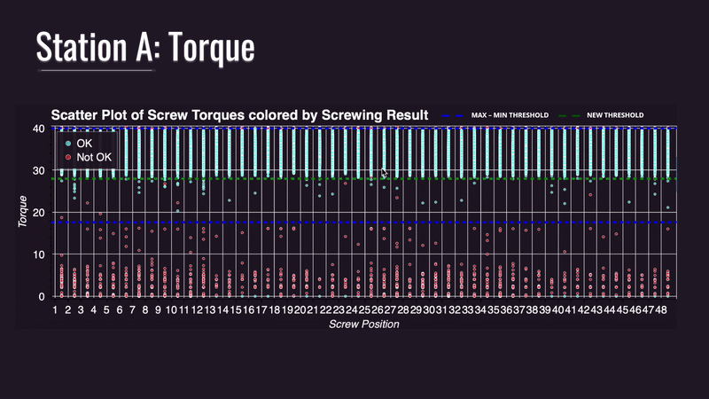

# Volta – Powering Up Your Data

Volta is an Industry 4.0 solution designed for an automotive company.

---

## Overview

**Volta** leverages advanced data analytics and machine learning techniques to diagnose and optimize complex manufacturing processes. The project focuses on two main production stations (referred to as Station 120 and Station 160), where multiple groups of robots perform tasks such as battery placement, screwing, and material consumption. By capitalizing on data from various sensors and operational parameters (e.g., process time, torque, angle, and position), Volta aims to identify key factors that affect performance and to help the company reduce error rates (OK/NOK outcomes) while increasing throughput.

---

## Key Components

### 1. Process Overview

- **Stations & Robot Groups**:  
  - **Station 120**: Divided into three sub-stations (120.1, 120.2, 120.3) responsible for battery placement and associated tasks.
  - **Station 160**: Consists of two sub-stations (160.1, 160.2) focused on connecting batteries and screwing operations.

- **Critical Processes**:  
  - **Placing**: Involves module positioning, placement of batteries, and coordination with subsequent screwing operations.
  - **Screwing**: Involves applying torque and angle to fasten components. The analysis includes measuring actual values (AV) versus nominal (NV) and tolerance (lower tolerance [LT] and upper tolerance [UT]) thresholds.
  - **Material Consumption & Other Variables**: Includes additional factors such as material consumption, environmental conditions (humidity, temperature), and total process time.

### 2. Most Important Variables

The analysis identified several key variables that impact process quality, including:
- **Process Time & Duration**: Total duration for each station and individual process steps.
- **Torque & Angle Measurements**: Critical for ensuring that screws are fastened correctly. Our analysis compares the actual values with predefined tolerance thresholds.
- **Result Classification (OK/NOK)**: Each process is labeled as OK (successful) or NOK (failure), and the correlations between process variables and outcome are thoroughly examined.
- **Additional Factors**: Variables like humidity, temperature, and material consumption also play a role in overall process performance.

### 3. Objectives

- **Increase Lower Tolerance**: Improve the process robustness by increasing the lower tolerance limits, ensuring more consistent quality.
- **Reduce Upper Tolerance**: Decrease variability and prevent overshooting the desired operational thresholds.
- **Optimize Process Efficiency**: Leverage insights from torque, angle, and positional data to fine-tune robotic operations, ultimately increasing productivity and reducing errors.

---

## Methodology

Our approach combines several analytical and machine learning techniques:
- **Data Cleaning & Feature Engineering**:  
  - Standardized column names, handled missing data, and converted timestamp data.
  - Adjusted positional indexes to ensure consistency across processes.
  
- **Exploratory Data Analysis (EDA)**:  
  - Created correlation matrices and visualizations (bar plots, scatter plots, histograms) to assess relationships between process variables.
  - Analyzed OK/NOK distributions for both stations, using zoomed-in views for detailed insights.
  
- **Machine Learning & SHAP Analysis**:  
  - Applied classification methods (using XGBoost) to predict process outcomes.
  - Employed SHAP (SHapley Additive exPlanations) to interpret model predictions and identify the most influential features.
  
- **Clustering & Process Comparison**:  
  - Conducted clustering analyses to segment process discrepancies, particularly focusing on differences in screw angles, torque, and positional variances.
  - Compared performance between Station 120 and Station 160 to identify systematic differences and opportunities for process improvement.

---

## Results & Insights

- **Detailed Visualizations**:  
  - Plots for both torque and angle distributions highlighted differences between OK and NOK outcomes.
  - Zoomed visualizations enabled an in-depth focus on critical segments (e.g., the OK results for Station 160).
  
- **Process Diagnosis**:  
  - Analysis revealed that deviations in angle and torque—when not within tolerance thresholds—are strongly linked to NOK outcomes.
  - Comparative analysis between stations showed that Station 120 and Station 160 exhibit different process dynamics, suggesting tailored improvement strategies.

- **Business Impact**:  
  - By identifying and addressing process variability, Volta helps improve product quality and reduces rework, ultimately saving costs and increasing plant throughput.
  - The solution provides actionable insights for both immediate adjustments and long-term process upgrades.

---

## Next Steps

- **Refinement of Tolerance Levels**: Further fine-tune tolerance thresholds for torque and angle to better align with operational realities.
- **Real-Time Monitoring**: Implement real-time dashboards for continuous process monitoring and adaptive control.
- **Extended Analysis**: Expand the analysis to include additional variables (e.g., environmental factors) and integrate feedback loops to support continuous improvement.

---

## Conclusion

Volta demonstrates how advanced data analytics and machine learning can be applied to overcome obstacles in the automotive manufacturing process. By powering up your data, Volta not only identifies critical process inefficiencies but also provides a roadmap for operational excellence in an Industry 4.0 environment.

---

This README serves as a high-level summary of the project, its methodology, key findings, and future directions. Enjoy exploring the power of data with Volta!

